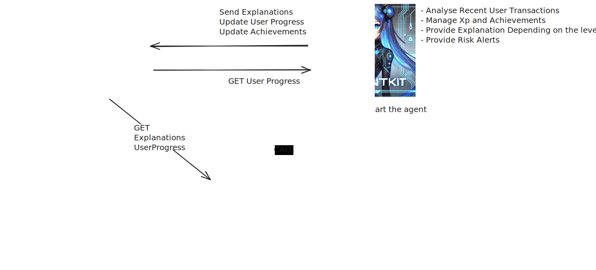

# 🚀 AgenticEthereum-OnchainBuddy

Onchain Buddy is an AI assistant that helps beginners understand their blockchain activities. It analyzes transactions, explains them in simple terms, and guides users to learn about blockchain in a safe and proper way.

As your personal blockchain companion he acts as a real-time translator between complex blockchain operations and everyday language.

To making your first token swap or approving a new smart contract, it break down each action in clear and understandable explanations.

## 🏗 Architecture

The project is divided into three main components:

### Backend
- Handles user data persistence
- Manages XP and achievements system
- Provides API endpoints for frontend

### Agent
- Processes blockchain transactions
- Generates explanations using GPT-4
- Monitors wallet activity
- Assesses transaction risks

### Frontend
- User interface for wallet connection
- Displays transaction explanations
- Shows progression system
- Presents achievements

## Workflow



## Features

### User Interface
- Connect your wallet to get started 
- See detailed transaction explanations adapted to your level
- Track your blockchain learning progression through levels and XP
- Earn achievements for blockchain milestones
- Get real-time risk alerts for transactions

### Agent
- **Smart Transaction Monitoring**
  - Real-time tracking of wallet activity
  - Automatic detection of new transactions
  - Immediate analysis and notifications

- **Intelligent Analysis System**
  - Detailed explanation of transaction mechanics
  - Risk assessment and safety recommendations
  - Level-appropriate explanations that evolve with user expertise
  - Support for ETH transfers, ERC20 operations and complex contract interactions

- **Educational Progression System**
  - Dynamic XP system with multipliers based on:
    - Transaction complexity
    - Consecutive daily activity
    - New contract interactions
    - Risk identification
  - Achievements system to reward learning milestones
  - 3-tier progression: Beginner (1-30), Intermediate (31-70), Expert (71-100)

- **Risk Assessment**
  - Smart contract verification checks
  - Gas usage analysis
  - Value transfer monitoring
  - Contract interaction complexity evaluation
  - Custom safety recommendations

- **Transaction Details Processing**
  - Gas cost calculation
  - Method identification
  - Event logging and analysis
  - Contract interaction decoding
  - Value transfer tracking

## 🔧 Technology Stack
- Built on Base Network
- Powered by GPT-40-mini for natural language processing
- Uses Basescan API for blockchain data
- Real-time monitoring through Base RPC
- AgentKit as AI agent

#### Frontend
- **Next.js** - React framework for production
- **TailwindCSS** - Utility-first CSS framework
- **Material-UI (MUI)** - React UI component library

#### Blockchain Integration
- **Ethers.js** - Ethereum wallet operations and smart contract interactions
- **OnchainKit** - Coinbase's wallet integration toolkit
- **AgentKit** - AI agent framework for blockchain
- **Solidity** - Smart contract development

#### Backend & Infrastructure
- Built on Base Network
- Powered by GPT-4 for natural language processing
- Uses Basescan API for blockchain data
- Real-time monitoring through Base RPC

## How to use (dev)

### Backend

#### Prepare DB and run server
```bash
$ cd backend/
$ npm install
$ npx prisma generate
$ npx prisma db push
$ node server.js
```
### Agent

#### Run server
```bash
$ cd agent/
$ npm install
$ npx ts-node src/app.ts
```

### Frontend

#### Start
```bash
$ cd front/
$ npm install
$ npm run dev
```

### All .env variables needed

```bash
OPENAI_API_KEY=your_key
CDP_API_KEY_NAME=your_key_name
CDP_API_KEY_PRIVATE_KEY=your_private_key
BASESCAN_API_KEY=your_key
BACKEND_API_URL=http://your-backend
BACKEND_API_KEY=your_backend_key
BASE_RPC_URL=https://mainnet.base.org
NETWORK_ID=base-mainnet
```

## 🙏 Acknowledgments

- Built during ETHGlobal Hackathon
- Powered by Coinbase's AgentKit
- Base Network for infrastructure support

## Wireframes

[OnchainBuddy Notion](https://www.notion.so/Mockups-Wireframes-18fa0cf912048082a011f0a3bfa3cb4f?pvs=4)